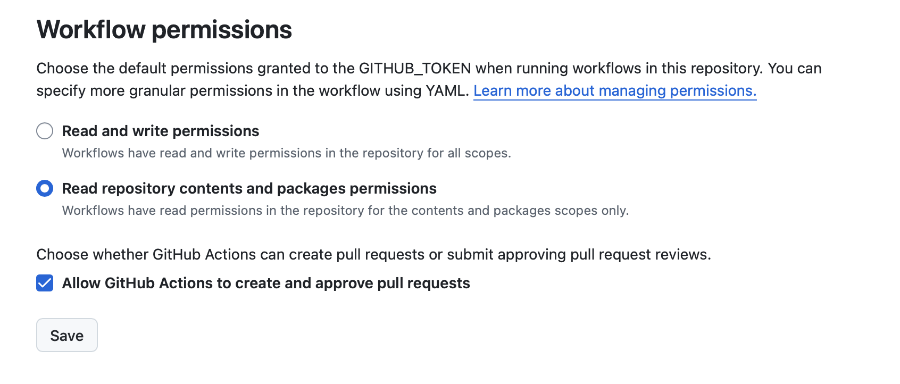

# GitHub Package Example

<!-- markdownlint-disable MD036 -->
_NPM + GitHub Packages + Changesets_
<!-- markdownlint-enable MD036 -->

An example NPM package published to GitHub packages using [changesets](https://github.com/changesets/changesets) automation to manage package versioning and publishing.

## Why?

It's useful to share private packages within an organization. The setup here attempts to do so with a few goals in mind:

* **Automate releases** by building and publishing on a CI
* **Follow [SemVer](https://semver.org)** without individuals needing to keep track of changes
* **Follow [GitHub flow](https://docs.github.com/en/get-started/using-github/github-flow)**, a common branch-based workflow. This means changes go through pull requests and approvals; no need to ever push to _main_
* **_main_ is the source of truth** so it's trivial to develop downstream packages against unreleased changes - just point to _main_ (more on this below)

## Setup

1. Create a new GitHub repository

2. Configure npm to publish to [GitHub packages](https://docs.github.com/en/packages/working-with-a-github-packages-registry/working-with-the-npm-registry#publishing-a-package-using-publishconfig-in-the-packagejson-file)

   ```json
   "publishConfig": {
    "registry": "https://npm.pkg.github.com/"
   }
   ```

3. Install [Changesets' automation](https://github.com/changesets/changesets/blob/main/docs/automating-changesets.md)

   1. Install the [changeset bot](https://github.com/apps/changeset-bot), which will comment on PRs to nudge/facilitate adding changesets
   2. Add the [changeset action](https://github.com/changesets/action) to automate bumping versions, maintaining the changelog, and publishing to GitHub packages. See [release.yml](./.github/workflows/release.yml) for an example.

4. In the repository under **Settings > Actions > General**, enable "Allow GitHub Actions to create and approve pull requests" to allow the changeset action to create the versioning PR.



### Optional but recommended

The following require a GitHub Team or Enterprise account.

* Enable branch protection for **main**
* Require a pull request before merging into **main**

## Release Workflow


## Not in Scope

* Publishing public packages to NPM. This is already a well-defined workflow [supported by Changesets](https://github.com/changesets/changesets/blob/main/docs/intro-to-using-changesets.md).
