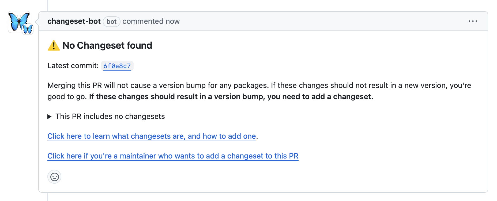
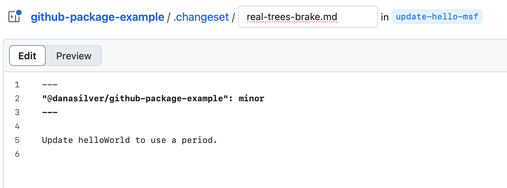
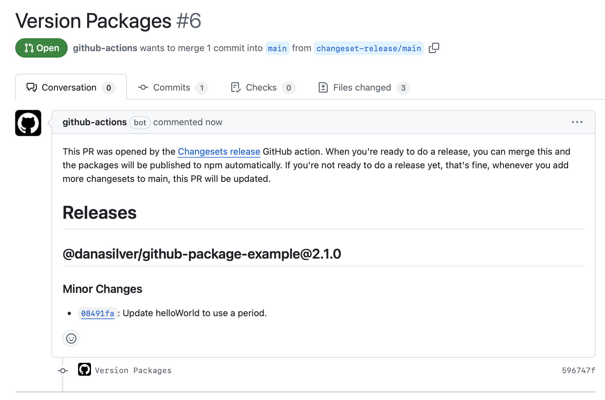

# GitHub Package Example

<!-- markdownlint-disable MD036 -->

_NPM + GitHub Packages + Changesets_

<!-- markdownlint-enable MD036 -->

An example NPM package published to GitHub packages using [changesets](https://github.com/changesets/changesets) automation to manage package versioning and publishing.

## Why?

It's useful to share private packages within an organization. The setup here attempts to do so with a few goals in mind:

- **Automated releases** built and published on a CI. Running the build and publish on GitHub Actions means consistent builds and no special setup on a developer's machine to release.
- **Intuitive versioning and a changelog** with a low maintenance cost. Changesets automates both of these, so there's no need for a maintainer to collect changes, determine version number bumps, or write release notes.
- **Development against unreleased changes** is possible by pointing at _main_ or a work-in-progress branch (more on this below).

## Setup

1. Create a new GitHub repository

2. Configure npm to publish to [GitHub packages](https://docs.github.com/en/packages/working-with-a-github-packages-registry/working-with-the-npm-registry#publishing-a-package-using-publishconfig-in-the-packagejson-file) by adding the following to _package.json_

   ```json
   "publishConfig": {
    "registry": "https://npm.pkg.github.com/"
   }
   ```

3. Install [Changesets' automation](https://github.com/changesets/changesets/blob/main/docs/automating-changesets.md)

   1. Install the changesets CLI: `npm install --save-dev @changesets/cli`
   2. Install the [changeset bot](https://github.com/apps/changeset-bot), which will comment on PRs to nudge/facilitate adding changesets
   3. Add the [changeset action](https://github.com/changesets/action) to automate bumping versions, maintaining the changelog, and publishing to GitHub packages. See [release.yml](./.github/workflows/release.yml) for an example. If you want to automatically publish when a changesets-generated PR is merged, make sure to use the `publish` option.

4. In the repository under **Settings > Actions > General**, enable "Allow GitHub Actions to create and approve pull requests" to allow the changeset action to create the versioning PR.


### Optional but recommended

The following require a GitHub Team or Enterprise account.

- Enable branch protection for _main_
- Require a pull request (and approvals) before merging into _main_

## Development and Release Workflow

1. Make some changes in the shared package following [GitHub flow](https://docs.github.com/en/get-started/using-github/github-flow) (create a branch, open a Pull Request)

2. The changesets bot will comment on the PR, prompting you to add a changeset if one does not already exist


3. Follow "Click here if you're a maintainer to add a changeset..." and create a changeset in the web editor. Use one of **patch**, **minor**, or **major** to indicate what kind of version bump is necessitated by the PR. Optionally, update the changelog entry.


4. Commit the changeset to the branch with the existing PR, get any approvals necessary, and merge to _main_.

5. When the changeset action runs, it'll create a second PR that bumps the package's version and collects any changelog entries. This PR will collect any subsequent unreleased changes.


6. When you're ready to release, merge the changeset-generated PR back into main. This time, the changeset action will release to GitHub packages.

## Developing Against Unreleased Changes

Suppose you're modifying a shared package used by a downstream service. You want to test the shared package's changes in the service without publishing the work in progress.

**Important:** Take care not commit these changes. Always point to a stable released version of a dependency in a production artifact.

### Point to local changes

In _package.json_:

```json
"dependencies": {
  "shared-packages": "file:../shared-package"
}
```

### Point to Git remote changes

See [NPM's documentation](https://docs.npmjs.com/cli/v11/configuring-npm/package-json#git-urls-as-dependencies) for more examples.

In _package.json_, for any Git remote the following works:

```json
"dependencies": {
  "shared-package": "git+ssh://git@github.com:my-org/shared-package.git#v1.0.27"
}
```

or for a GitHub repository use the simplified form:

```json
"dependencies": {
  "shared-package": "my-org/shared-package.git#feature\/branch"
}
```

## Known Issues

- [The shared package version in _package-lock.json_ is not updated.](https://github.com/changesets/changesets/issues/1139) This has no effect, the version listed there is purely cosmetic.
